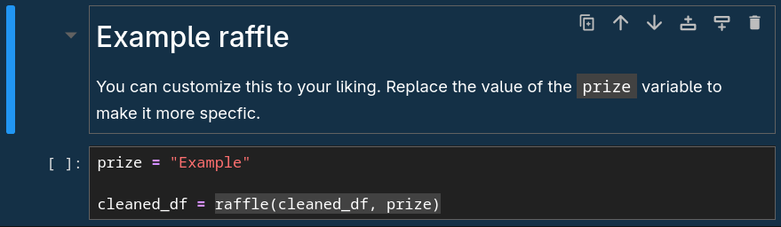
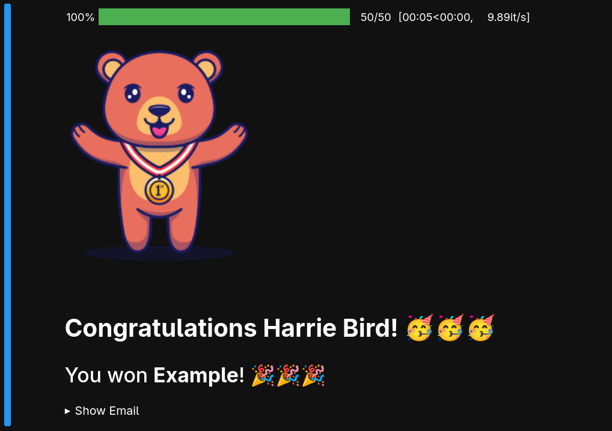

# pyraffle

A simple raffle notebook. This was initially made for the raffle in the Software Freedom
Day Bukidnon 2025. This was made compatible with the [Luma](https://luma.com/) guest list.

## Setup
1. Clone this repository.
2. Create a virtual environment using the command `python -m venv venv` and activate it. 
3. Install the requirements using the command `pip install -r requirements.txt`.
4. Download the guest list from Luma. Copy it inside the project directory and name it `guests.csv`.
5. Run the JupyterLab using the command `jupyter lab`.
6. Open the `pyraffle.ipynb` notebook and let the raffle begin! :)

## Adding New Raffle

The two cells in the image shown above is where the raffle happens. To add more raffles,
you can copy this two cells and paste it below. Modify the above markdown cell according
to your liking. Replace the value inside the `prize` variable if you want the prize to be
specific. Make the value of `prize` blank if you want to disable it.

An example of a raffle result is shown below:

## Note
- Aside from the default fields (like `name`, `email`, and `checked_in_at`) in Luma, a custom
question named `Status` should be added. Here are the details of the `Status` custom question:
    - Question Type: Options
    - Question: Status
    - Options: Professional, Student
    - Selection Type: Single
    - Required: Yes

## License
Code released under the [MIT License](LICENSE)

## Credits
- [Rosyid Ridho](https://www.vecteezy.com/members/arunika-std) of [Vercteezy](https://www.vecteezy.com/free-vector/background)
